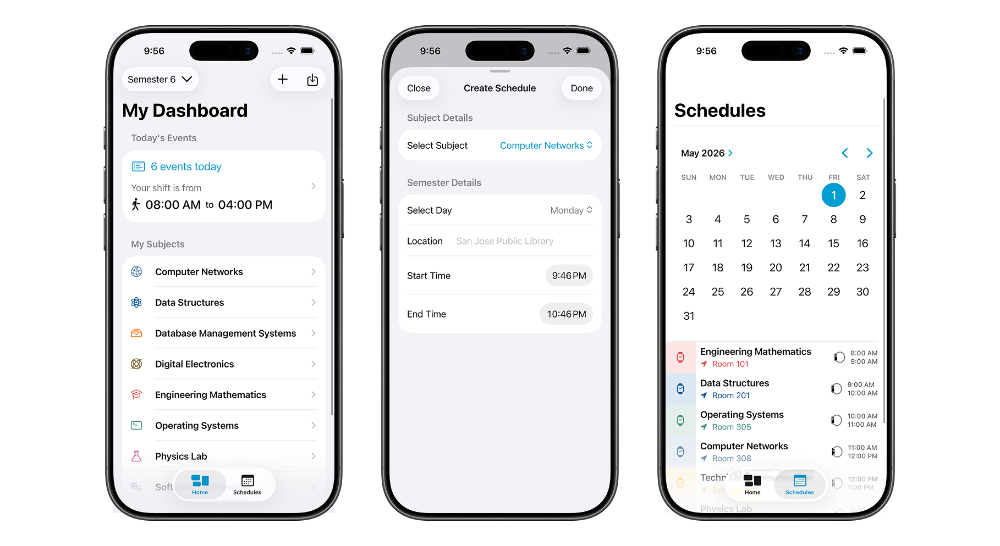

<p align="center">
  
</p>

<h1 align="center">eda</h1>
<p align="center"><strong>An attendance tracker born out of frustration.</strong></p>
<p align="center">
  
  
  
  
  
</p>

---

## The Problem

Every semester, the same ritual. You want to know how many classes you've attended in a subject — a simple question — and the answer is nowhere to be found.

Our college portal? Barely functional. Attendance data either shows up late, shows up wrong, or doesn't show up at all. The only reliable way to get your numbers is to walk up to each professor, one by one, and ask. No online request system for medical leaves. No way to know if you're dangerously close to falling below the minimum attendance threshold until it's too late.

I watched classmates get debarred from exams because they had no way to track where they stood. I was tired of the guesswork. So I stopped waiting for the system to get fixed and built my own.

## The Idea

What if I had a personal attendance tracker that lived on my phone — fully offline, no dependency on any college server — and just let me log every class as it happened?

But I didn't want a glorified spreadsheet. I wanted something that could actually *think* with me:

- **"You've attended 78% of Data Structures. You need 75%. You can safely skip 3 more classes this semester."**
- **"Your Operating Systems attendance dropped 4% this week. Be careful."**

That insight — knowing exactly how much room you have — is what makes the difference between stressing about attendance and actually managing it.

That's why I built **eda**.

---

<p align="center">
  
</p>

---

## What It Does

**eda** is a native iOS app that tracks your attendance across semesters, subjects, and class types. Everything runs locally on your device — no accounts, no servers, no waiting.

### The Core Loop

1. **Set up your semester** — name it, set the date range, define your required attendance percentage.
2. **Add your subjects** — pick a color, pick an icon, assign a teacher. Or bulk-import everything from a CSV file in seconds.
3. **Add your timetable** — map each subject to its weekly schedule with room numbers and time slots. Or bulk-import this too.
4. **Mark attendance as you go** — present, absent, or medical leave. One tap from the dashboard.
5. **Watch the numbers** — weekly trend charts, running percentages, and real-time insights.

### Features

| | |
|---|---|
| **Semester Management** | Create multiple semesters with custom date ranges and passing thresholds |
| **Subject Profiles** | 9 colors, 28 icons — each subject gets its own visual identity |
| **Smart Scheduling** | Weekly timetable with conflict detection and active-class highlighting |
| **Attendance Tracking** | Theory, Lab, and custom class types with Present / Absent / Medical status |
| **Bulk Attendance** | Mark attendance for all of today's classes in one screen |
| **Weekly Trend Charts** | Running attendance percentage visualized over time |
| **CSV Bulk Import** | Import all subjects and schedules from CSV files — no manual entry needed |
| **Daily Reminders** | Push notifications at 9 AM, 1 PM, and 6 PM to keep you on track |
| **Fully Offline** | Everything lives on your device. No internet required. Ever. |

## How It's Built

### Architecture

```
eda/
├── App/             → Entry point, tab navigation
├── View/            → Dashboard, Schedule, Attendance screens
├── View/Sheets/     → 10+ modal forms (create, edit, import)
├── ViewModel/       → MVVM layer — one ViewModel per domain
├── Repository/      → Core Data abstraction with DTOs
├── Components/      → Reusable UI building blocks
├── Services/        → Notification scheduling and management
└── Persistence      → Core Data stack
```

**Pattern:** MVVM with a clean Repository layer. ViewModels are `@MainActor` and use `async/await` throughout. Repositories wrap Core Data operations behind Data Transfer Objects so the UI never touches managed objects directly.

**Caching:** Subjects cache for 10 minutes, schedules and attendance for 5 minutes — timestamp-based expiry with automatic invalidation on any mutation.

### Data Model

```
Semester
  └── subjects (1 : many)
        Subject
          ├── schedules (1 : many)
          │     Schedule
          └── attendances (1 : many)
                Attendance
```

All relationships cascade on delete — removing a semester cleanly removes everything underneath it.

### Tech Stack

| Layer | Technology |
|---|---|
| UI | SwiftUI |
| Data | Core Data (local SQLite) |
| Concurrency | Swift async/await · @MainActor |
| Charts | Apple Charts framework |
| Notifications | UserNotifications |
| CSV Import | SwiftCSV (Swift Package Manager) |
| Logging | os.log |

## Sample Data

Want to try the bulk import feature? Sample CSV files are included in [`sample-data/`](sample-data/):

- **[`subjects.csv`](sample-data/subjects.csv)** — 9 subjects with teachers, colors, and icons
- **[`schedules.csv`](sample-data/schedules.csv)** — 24 weekly class slots mapped to those subjects

Import subjects first, then schedules. The schedule importer matches subjects by name.

## Getting Started

```bash
git clone https://github.com/yourusername/eda.git
cd eda
open eda.xcodeproj
```

Build and run on an iOS simulator or device. No API keys, no environment variables, no setup — just build and go.

---

<p align="center"><sub>Built because the system wouldn't fix itself.</sub></p>
